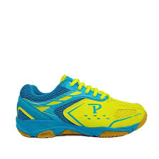
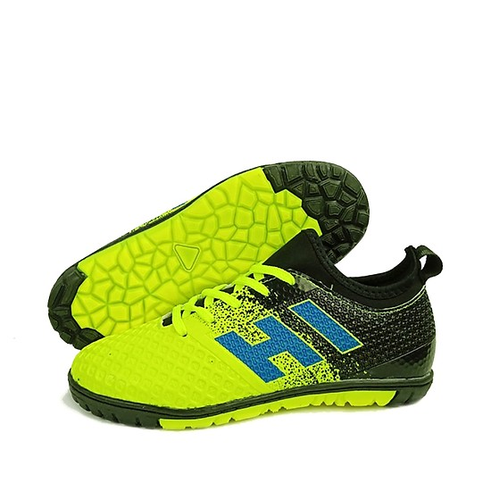
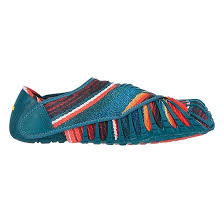
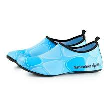

<!DOCTYPE html>
<html lang="en">

<head>
	<meta charset="UTF-8">
	<meta name="viewport" content="width=device-width, initial-scale=1.0">
	<meta http-equiv="X-UA-Compatible" content="ie=edge">
	<link rel="stylesheet" href="./CSS/style.css">
	<link rel="stylesheet" href="./CSS/bootstrap.min.css">
	<link rel="stylesheet" href="https://cdnjs.cloudflare.com/ajax/libs/font-awesome/5.11.2/css/all.css">
	<title>shop giay</title>
</head>

<body>
	<!-- start header -->
	<header class="header-area">
		

			<nav class="navbar navbar-expand-lg navbar-light sticky-top sticky-top">
				
				<button class="navbar-toggler" type="button" data-toggle="collapse" data-target="#navbarNav"
					aria-controls="navbarNav" aria-expanded="false" aria-label="Toggle navigation">
					
				</button>
				

					<ul class="navbar-nav ml-auto">
						<li class="nav-item active">
							<a class="nav-link" href="#">Home </a>
						</li>
						<li class="nav-item">
							<a class="nav-link" href="#">About</a>
						</li>
						<li class="nav-item">
							<a class="nav-link" href="#">Service</a>
						</li>
						<li class="nav-item">
							<a class="nav-link" href="#">team</a>
						</li>
						<li class="nav-item">
							<a class="nav-link" href="#">Service</a>
						</li>
						<li class="nav-item">
							<a class="nav-link" href="#">Service</a>
						</li>
					</ul>
				

			</nav>
		

	</header>
	<!-- end header -->

	<!-- start slise -->
	

		

			<ol class="carousel-indicators">
				<li data-target="#carouselExampleIndicators" data-slide-to="0" class="active"></li>
				<li data-target="#carouselExampleIndicators" data-slide-to="1"></li>
				<li data-target="#carouselExampleIndicators" data-slide-to="2"></li>
			</ol>
			

				

					
					

						<h1 class="display-2">Example</h1>
						<h3>Auto Layout with bootstrap</h3>
						<button type="button" class="btn btn-outline-light btn-lg">View Product</button>
					

				

				

					
				

				

					
				

			

			<a class="carousel-control-prev" href="#carouselExampleIndicators" role="button" data-slide="prev">
				
				Previous
			</a>
			<a class="carousel-control-next" href="#carouselExampleIndicators" role="button" data-slide="next">
				
				Next
			</a>
		

	

	

	<!-- start slise -->

	<!-- show product -->
	

		

			<h2 class="list-product-title  ">New Product</h2>
			

				
list product description

			

			

				

					

						

							
							

								<h5 class="card-title product-title">Product</h5>
								

									100.000 vnd
									80.000 vnd
									

										<a href="" class="btn btn-info"><i class="fas fa-shopping-cart"></i></a>
										<a href="" class="btn btn-outline-info">xem chi tiet</a>
									

								

							

						

					

					

						

							
							

								<h5 class="card-title product-title">Product</h5>
								

									100.000 vnd
									80.000 vnd
									

										<a href="" class="btn btn-info"><i class="fas fa-shopping-cart"></i></a>
										<a href="" class="btn btn-outline-info">xem chi tiet</a>
									

								

							

						

					

					

						

							
							

								<h5 class="card-title product-title">Product</h5>
								

									100.000 vnd
									80.000 vnd
									

										<a href="" class="btn btn-info"><i class="fas fa-shopping-cart"></i></a>
										<a href="" class="btn btn-outline-info">xem chi tiet</a>
									

								

							

						

					

					

						

							
							

								<h5 class="card-title product-title">Product</h5>
								

									100.000 vnd
									80.000 vnd
									

										<a href="" class="btn btn-info"><i class="fas fa-shopping-cart"></i></a>
										<a href="" class="btn btn-outline-info">xem chi tiet</a>
									

								

							

						

					

					

						

							
							

								<h5 class="card-title product-title">Product</h5>
								

									100.000 vnd
									80.000 vnd
									

										<a href="" class="btn btn-info"><i class="fas fa-shopping-cart"></i></a>
										<a href="" class="btn btn-outline-info">xem chi tiet</a>
									

								

							

						

					

					

						

							
							

								<h5 class="card-title product-title">Product</h5>
								

									100.000 vnd
									80.000 vnd
									

										<a href="" class="btn btn-info"><i class="fas fa-shopping-cart"></i></a>
										<a href="" class="btn btn-outline-info">xem chi tiet</a>
									

								

							

						

					

					

						

							
							

								<h5 class="card-title product-title">Product</h5>
								

									100.000 vnd
									80.000 vnd
									

										<a href="" class="btn btn-info"><i class="fas fa-shopping-cart"></i></a>
										<a href="" class="btn btn-outline-info">xem chi tiet</a>
									

								

							

						

					

					

						

							
							

								<h5 class="card-title product-title">Product</h5>
								

									100.000 vnd
									80.000 vnd
									

										<a href="" class="btn btn-info"><i class="fas fa-shopping-cart"></i></a>
										<a href="" class="btn btn-outline-info">xem chi tiet</a>
									

								

							

						

					

					

						

							
							

								<h5 class="card-title product-title">Product</h5>
								

									100.000 vnd
									80.000 vnd
									

										<a href="" class="btn btn-info"><i class="fas fa-shopping-cart"></i></a>
										<a href="" class="btn btn-outline-info">xem chi tiet</a>
									

								

							

						

					

				

			

	

	<!-- Footer -->
	<footer class="page-footer ml-auto">

			<!-- Footer Links -->
			

				<!-- Grid row -->
				

					<!-- Grid column -->
					

						<!-- Content -->
						<h5 class="font-weight-bold text-uppercase mt-3 mb-4">Footer Content</h5>
						
Here you can use rows and columns to organize your footer content. Lorem ipsum dolor sit
							amet,
							consectetur
							adipisicing elit.

					

					<!-- Grid column -->

					

					<!-- Grid column -->
					

					

					<!-- Grid column -->

					

					<!-- Grid column -->
					

						<!-- Links -->
						<h5 class="font-weight-bold text-uppercase mt-3 mb-4">Links</h5>

						
						
Lorem ipsum dolor sit amet consectetur 

					

					<!-- Grid column -->

					

					<!-- Grid column -->
					

						<!-- Links -->
						<h5 class="font-weight-bold text-uppercase mt-3 mb-4">Links</h5>
						
						
Lorem ipsum, dolor sit amet consectetur 

					

					<!-- Grid column -->

				

				<!-- Grid row -->

			

			<!-- Footer Links -->

			

			<!-- Call to action -->
			<ul class="list-unstyled list-inline text-center py-2">
				<li class="list-inline-item">
					<h5 class="mb-1">Register for free</h5>
				</li>
				<li class="list-inline-item">
					<a href="#!" class="btn btn-danger btn-rounded">Sign up!</a>
				</li>
			</ul>
			<!-- Call to action -->

			

			<!-- Social buttons -->
			<ul class="list-unstyled list-inline text-center">
				<li class="list-inline-item">
					<a class="btn-floating btn-fb mx-1">
						<i class="fab fa-facebook-f"> </i>
					</a>
				</li>
				<li class="list-inline-item">
					<a class="btn-floating btn-tw mx-1">
						<i class="fab fa-twitter"> </i>
					</a>
				</li>
				<li class="list-inline-item">
					<a class="btn-floating btn-gplus mx-1">
						<i class="fab fa-google-plus-g"> </i>
					</a>
				</li>
				<li class="list-inline-item">
					<a class="btn-floating btn-li mx-1">
						<i class="fab fa-linkedin-in"> </i>
					</a>
				</li>
				<li class="list-inline-item">
					<a class="btn-floating btn-dribbble mx-1">
						<i class="fab fa-dribbble"> </i>
					</a>
				</li>
			</ul>
			<!-- Social buttons -->

			<!-- Copyright -->
			
© 2018 Anh Tien:
				<a href="https://mdbootstrap.com/education/bootstrap/"> vantien2000.gibhub.io</a>
			

			<!-- Copyright -->

	</footer>
	
	<!-- Footer -->

	
	
</body>

</html>
